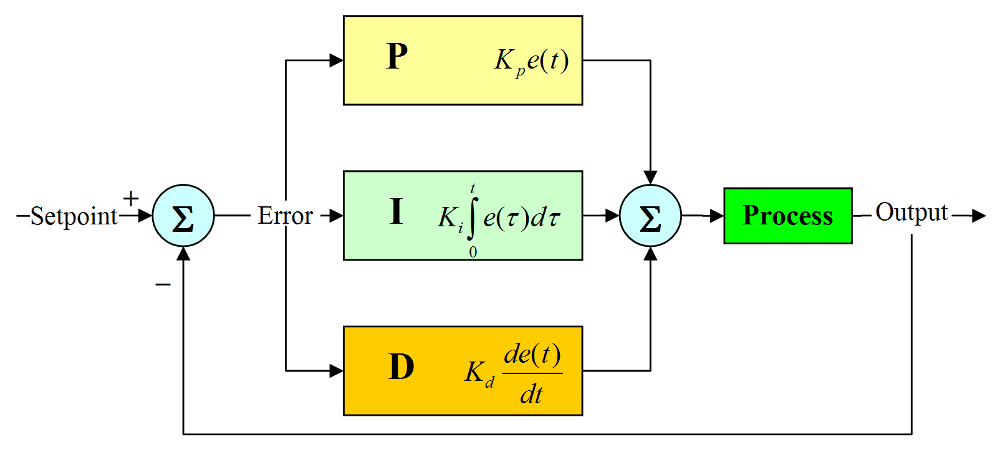

# What is a PID Controller?
A PID controller is an instrument used in industrial control applications to regulate temperature, flow, pressure, speed and other process variables. PID (proportional integral derivative) controllers use a control loop feedback mechanism to control process variables and are the most accurate and stable controller. PID control is a well-established way of driving a system towards a target position or level. It's a practically ubiquitous as a means of controlling temperature and finds application in myriad chemical and scientific processes as well as automation. PID control uses closed-loop control feedback to keep the actual output from a process as close to the target or setpoint output as possible.

# Basic Principle of PID Controller 

# Application of PID Controller
* Can be used in almost all vehicles.
* Provide better stability of the vehicle.
* Increase riding comfort.
* Maintenance cost decreases.

# Resources & References 
1. https://medium.com/@nimrakhalid/applications-of-pid-controller-3fb98d3ba9c6
2. https://studiousguy.com/pid-controller-working/
3. https://docs.google.com/document/d/116ih3wTxCZcuZVwRmzIVFMSBMAj-teacFgMNISVfmAA/edit#
4. https://stackoverflow.com/questions/62494680/getting-the-last-error-for-a-pid-controller
